# Steam

Replication of [Steam website](https://store.steampowered.com/), the largest video game retailer for PC games. Database is created in BCNF (Boyce Codd Normal Form). Authentication is done via cookies that stores access tokens and refresh tokens (JWTs); users can search for games, including games that are on sale; users can post, delete, edit their reviews; edit their profile and username; add games to their cart. Data is stored on PostgreSQL. Developed with React, Redux, Express, Typescript, React-Testing-Library, Jest, TravisCI, JS, HTML, CSS.

Deployment / Production repo: https://github.com/mattfrancis888/steam

### BCNF database graph:

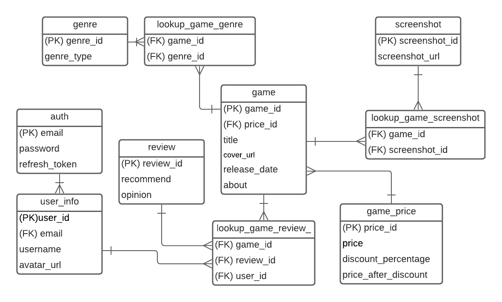

### What I learned:

-   In testing, I'm using a library that mocks HTTP requests called `mock-axios-adapter`. The mocked HTTP requests will sometimes execute the HTTP requests when testing (eg; a POST would sometimes get executed). In addition, TravisCI returns an error of: `Error: connect ECONNREFUSED 127.0.0.1:80` because of `mock-axios-adapter`.It is related to HTTP request using locahost:5000. Using a proxy in package.json does not solve it. I am unable to find any workarounds with these issues and will be using and will use other mocking HTTP request libraries for future projects.

## PostgreSQL

-   Able to create queries for many to many relationship tables/junction tables by using subqueries, ARRAY_AGG().

    {
    "games": [
    "base_info": [
    {
    "game_id": 1,
    "title": "Monsters Inc Game"
    },
    {
    "game_id": 2,
    "title": "Dora Game"
    },
    ],
    "genres": [
    {
    "genre_id": 1,
    "game_id": 1,
    "genre_type": "Action"
    },
    {
    "genre_id": 2,
    "game_id": 2,
    "genre_type": "Fantasy"
    }
    ],
    ]
    }

**Into**

       {
           "games": [
                {
                    "game_id": 1,
                    "title": "Monsters Inc Game"
                    "genres": [
                        {
                            "genre_id": 1,
                            "game_id": 1,
                             "genre_type": "Action"
                         }....
                     ]
                },
            "genres": [
                {
                    "genre_id": 1,
                    "game_id": 1,
                    "genre_type": "Action"
                },
                {
                    "genre_id": 2,
                    "game_id": 2,
                    "genre_type": "Fantasy"
                }
            ],
        ]
    }

-   Generated columns for PostgreSQL v12 and above.

        CREATE TABLE game_price (
        price_id  SERIAL PRIMARY KEY,
        price DECIMAL(19, 4),
        discount_percentage DECIMAL(19,4),
        price_after_discount DECIMAL(19, 4)  GENERATED ALWAYS AS (price - (price * discount_percentage)) STORED
        );

Note to me: Our database is hosted with PostgreSQL v11. Thus, when we try to `RESTORE` our `pg_dump` the table above would not be created. I was not able to use **GENERATED COLUMNS** and had to create another `game_price` table without it and manually insert all the values again.

## Express.Js

-   Able to inject SQL for many to many relationship tables/junction tables with reducer() and map().

    {
    "games": [
    "base_info": [
    {
    "game_id": 1,
    "title": "Monsters Inc Game"
    },
    {
    "game_id": 2,
    "title": "Dora Game"
    },
    ],
    "genres": [
    {
    "genre_id": 1,
    "game_id": 1,
    "genre_type": "Action"
    },
    {
    "genre_id": 2,
    "game_id": 2,
    "genre_type": "Fantasy"
    }
    ],
    ]
    }

**Into**

       {
           "games": [
                {
                    "game_id": 1,
                    "title": "Monsters Inc Game"
                    "genres": [
                        {
                            "genre_id": 1,
                            "game_id": 1,
                             "genre_type": "Action"
                         }....
                     ]
                },
                {
                    "game_id": 2,
                    "title": "Dora"
                    "genres": [
                        {
                            "genre_id": 1,
                            "game_id": 2,
                             "genre_type": "Action"
                         },
                     ]
                }

               ....
            ]
        }

## External Resources:

-   pgAdmin 4 for PostgreSQL GUI.
-   Postman to test API requests.
-   Prettier to format code and EsLint for linting.
-   Redux dev tool google chrome extension to check the values of the states.
-   React dev tool to check the value of props.

## What It Looks Like

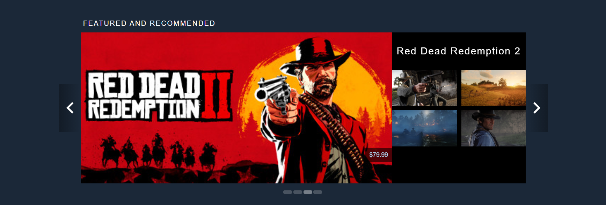
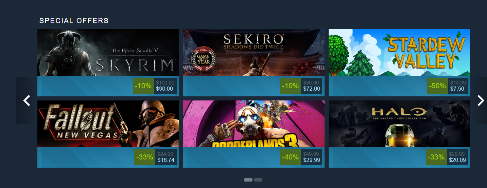
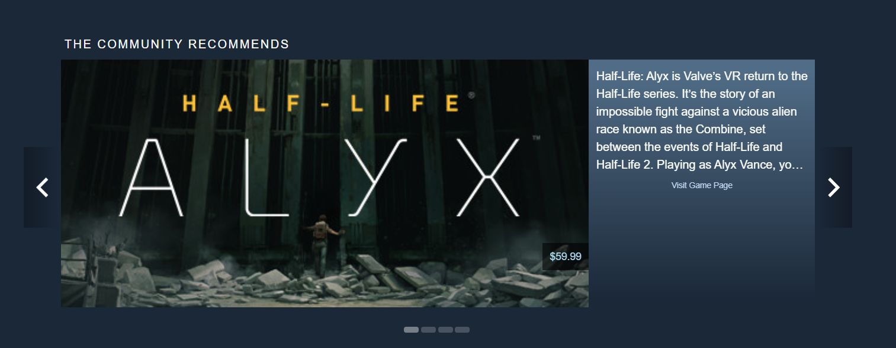
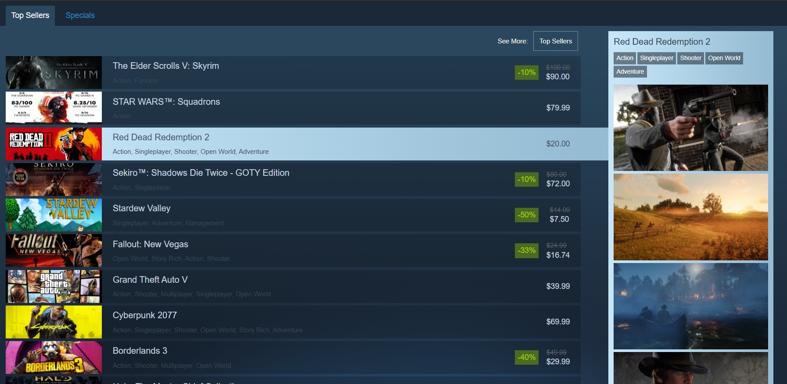
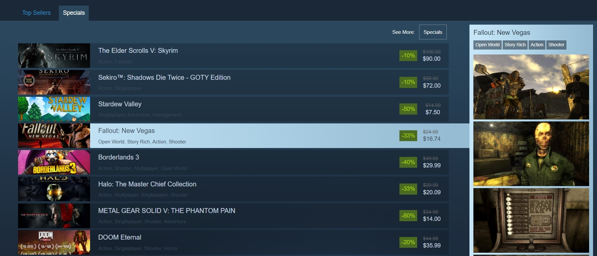
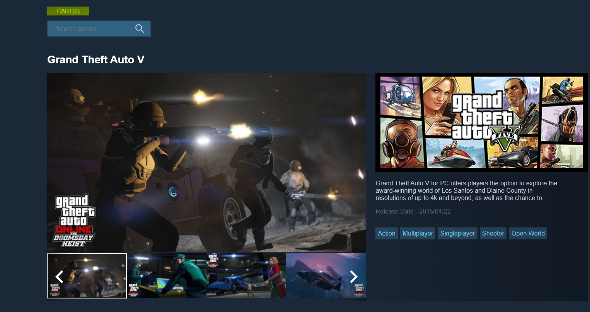
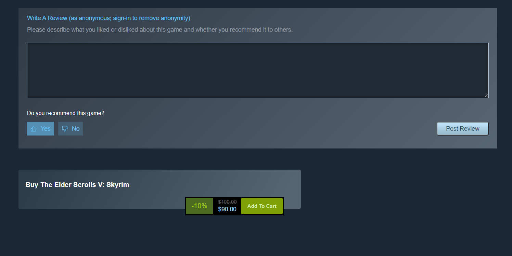
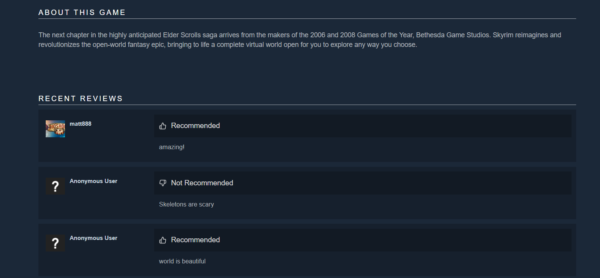
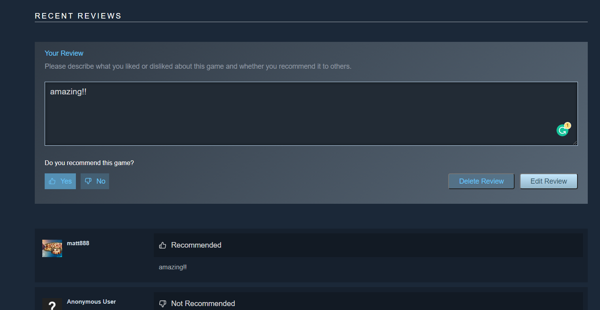
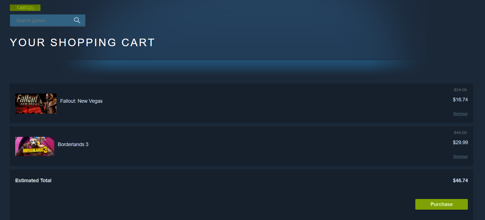
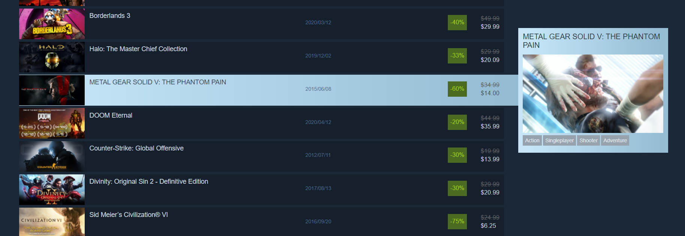
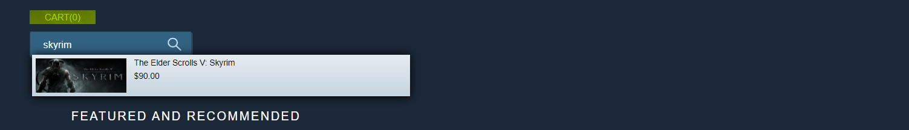
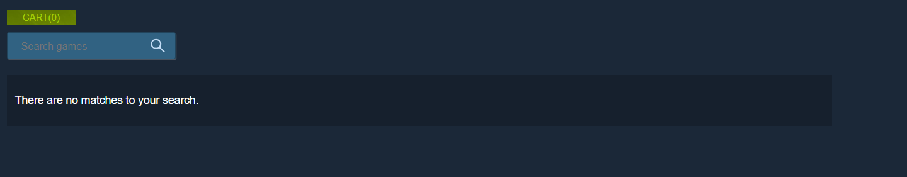
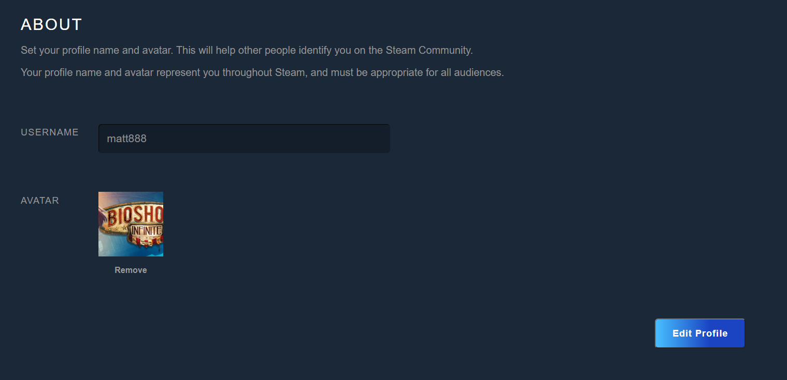
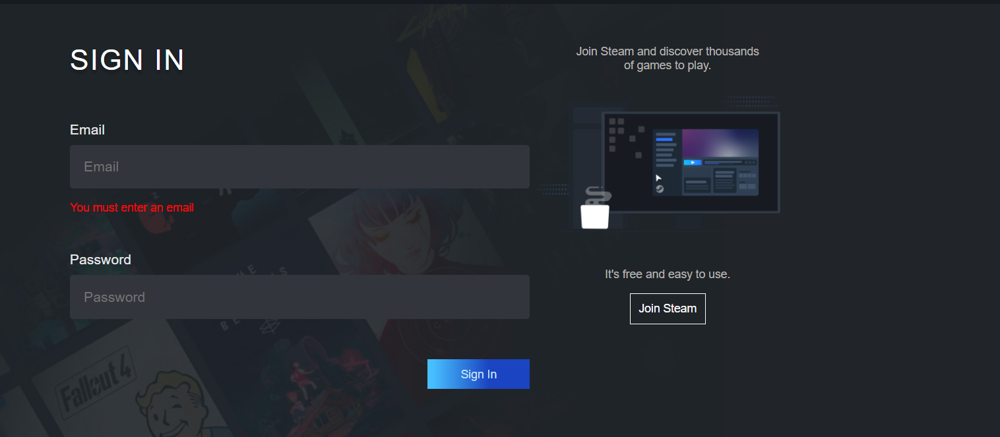
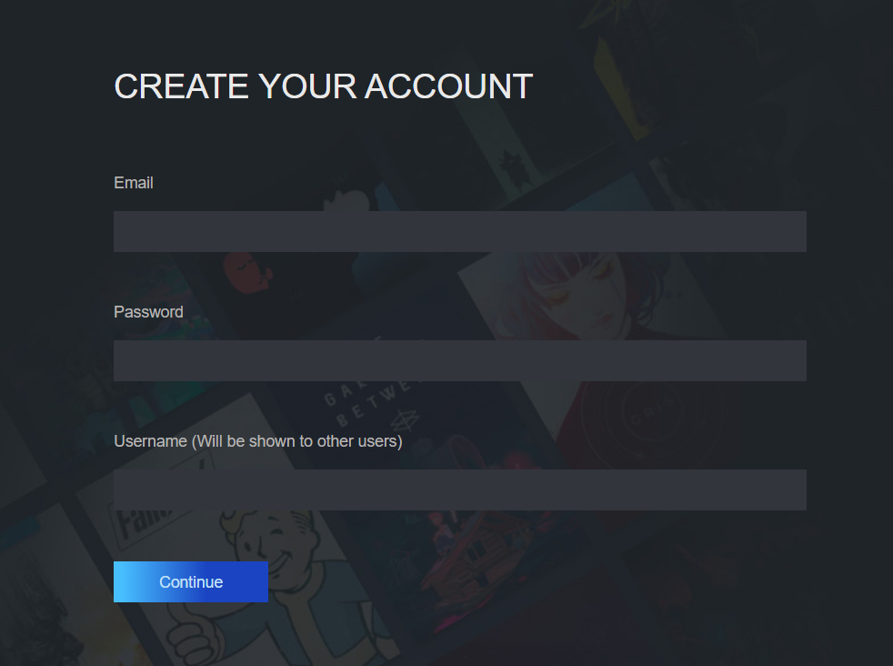

# Getting Started

These instructions will get you a copy of the project up and running on your local machine for development and testing purposes.

1. Clone the project. Use `npm install` to install all the dependencies. Go to the client directory, run the project with `npm start` for development or `npm run build` for production.

2. OPTIONAL: If you want to make changes locally, on the terminal, go to the `backend` directory. Type `npm run convert` to start the local server. The command would also listen to changes and convert the Express Typescript files to Express Javascript files that will be used for production. Create your own local database by restoring the pg_dump file of the steam database given (called ‘team_prodroot directory). Configure your own Pool settings in databasePool.

# Prerequisites

What things you need to install the software

```
- Any package manager (npm, yarn)
```

# Versioning

None
